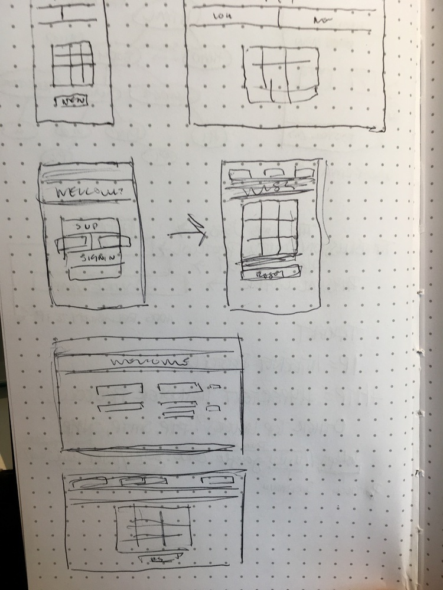

# Tic Tac Toe - By Eliza Davis

## Technologies used:
1. HTML
2. CSS & Sass
3. JavaScript & JQuery

## User Stories:
1. As a user, I want to sign up.
2. As a user, I want to sign in.
3. As a user, I want to change my password.
4. As a user, I want to sign out.
5. As a user, I want to play a game.
6. As a user, I want to see who won the game.
7. As a user, I want to see how many games I have played.

## Planning, Development Process, Problem-Solving:

In the planning phase, I came up with a basic game design and thought about how
I would write the gameplay logic. Since I came into the course with very little
web development experience, most of my planning was considered around the work
and lessons that we had covered in our first few weeks of class.

When beginning the project, I had our API lessons fresh in my mind and figured
this would be a good place to start. I set up the authorization first and got a
rough visual up on the page. After making some decent progress in the first few
hours, I kind of hit a mental block and wasn't sure how to proceed. After some
time, I got over the hump and started working things out. My steps then were
roughly as follows:

1. Get marks to show on gameboard
2. Make sign-up/sign-in and change password/sign-out mutually exclusive
3. Write logic for x winning or o winning
4. Combine logic with marking spots
5. Connect API with game updates/moves
6. Access number of games played by user
7. View past games on gameboard
8. Clean up console logs, unnecessary/commeneted out code
9. Play around with CSS and responsive design

My biggest challenge has been learning where things 'belong' and how each module
works as a part of the whole. I still have plenty to learn, but my ability to
conceptualize the project as a whole as well as its moving pieces has come a
long way over the past week.

## Future Goals/Current Unaccomplishments:

1. My logic is functional, but messy. I'd like to tidy it up.
2. Use images to mark moves to get some themes going.
3. Revisit unfinished games and finish them.
